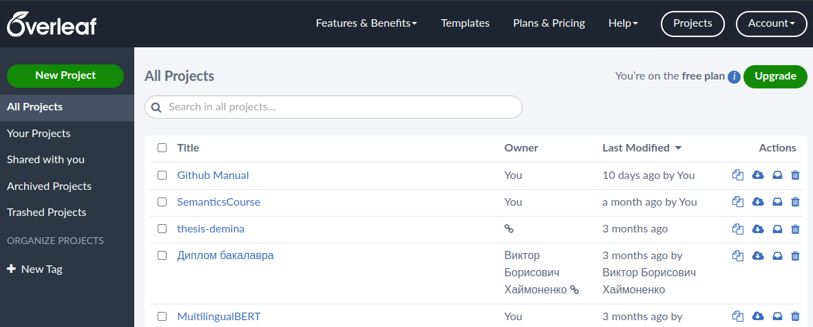
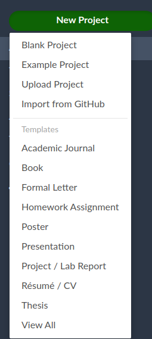
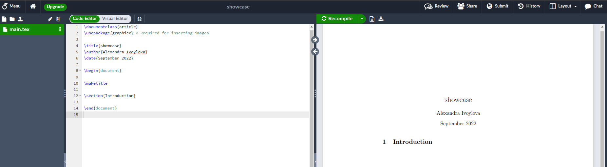
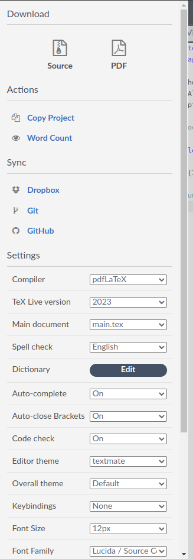
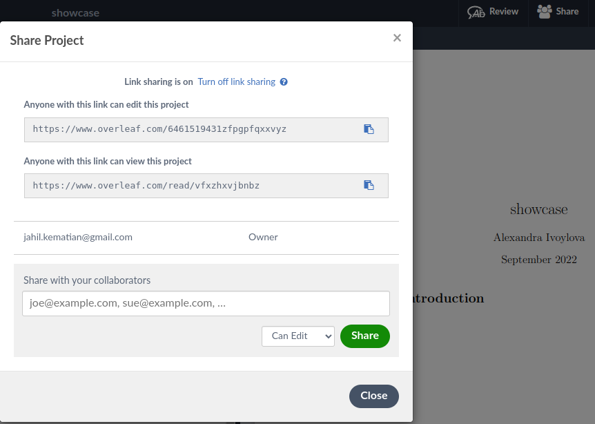
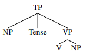
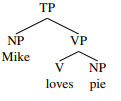
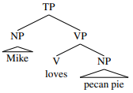
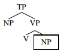
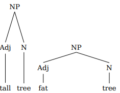

## LaTex - система верстки .pdf

#### Введение

Для чего вообще нужен LaTex (/ˈlɑːtɛk/ LAH-tek or /ˈleɪtɛk/ LAY-tek)? В латехе обычно верстаются самые разные .pdf: рабочие отчеты, презентации, научные статьи и во многих университетах также дипломы и диссертации (например, студенты-физтехи по требованиям верстают дипломы в нем). Непосвященному человеку латех может показаться страшным и непонятным, но стоит освоиться в нем, и оказывается, что верстать в латехе может быть удобнее, чем в Misrosoft Word: например, латех поддерживает специальный язык markdown для математических формул, а еще он умеет автоматически за вас собирать библиографию (и составлять правильные библиографические ссылки!), нумеровать картинки и таблицы и много чего другого. 

Латех - это, по существу, такой же язык (недоязык) программирования, как html или язык верстки Wikipedia: вы можете установить его компилятор локально, но обычно никто так не делает, потому что это довольно проблематично и неудобно. Удобнее всего пользоваться латехом онлайн через облачный ресурс [overleaf](https://www.overleaf.com/). На этом ресурсе нужно зарегистрироваться (достаточно подключить свой аккаунт гугл) и можно бесплатно верстать! Там есть платная версия, но и в бесплатной присутствуют все необходимые инструменты. 



На главной странице латех показывает все ваши проекты (и те проекты, которыми с вами кто-то поделился). Можно открыть один из существующих (если они уже есть) или создать новый. 
Создать новый проект можно несколькими способами:



Можно создать пустой новый проект, либо загрузить готовый проект в .zip (например, если конференция, статью для которой вы хотите писать, предоставляет шаблон: обычно у них на сайте можно скачать такой .zip), либо порыться в готовых шаблонах Templates: каждый пункт в меню - это на самом деле огромный выбор из готовых шаблонов соответствующего типа!

При работе с проектом (новым или нет) интерфейс латеха будет выглядеть следующим образом:



В панели слева можно видеть файлы, относящиеся к вашему проекту (для пустого проекта это единственный файл .tex - тот самый, в котором нужно писать код для компиляции). В этой панели можно заводить новые файлы и папки, загружать какие-нибудь файлы (обычно картинки). Когда в вашем проекте появится какая-то структура, в этой же панели снизу возникнет содержание документа. 

В большом окне в левой части можно собственно писать код; в правой части отображается результирующий .pdf. Имейте в виду, что латех пользуется компилятором: это означает, что результаты своей работы вы можете увидеть, только если нажмете кнопку recompile, автоматически они не подгружаются. Также справа можно нажать на кнопку для загрузки pdf, а между кнопками recompile & download находится кнопка, в которой можно увидеть логи компиляции: если на ней появляются красные циферки, это значит, что скомпилировалось с ошибками, если же циферки желтые - то это просто какие-то предупреждения, которые могут быть критичными, а могут быть вообще несущественными. 

На панели сверху в левой части есть кнопка Menu, открыв которую, можно получить следующую картинку:



Здесь тоже можно скачать либо весь ваш проект целиком в .zip, либо только pdf, посчитать, сколько в вашем проекте слов (для статей это очень важно), а также поменять какие-нибудь настройки или синхронизировать с гитхабом. 

Наконец, в правой части верхней панели есть важная кнопка Share, которая позволяет делиться своим проектом с коллегами точно  так же, как вы делаете это в Google Drive:



#### Верстка документа

Итак, допустим, мы с вами создали пустой документ и хотим что-то сверстать. По умолчанию в файле появляются следующие строки:

```
\documentclass{article}
\usepackage{graphicx} % Required for inserting images

\title{title}
\author{name}
\date{date}

\begin{document}

\maketitle

\section{Introduction}

\end{document}

```

Что они делают?

Как можно догадаться, все строки, которые начинаются на бэкслеш - это команды. Обычная команда в латехе имеет вид \\command\[\]\{\} (количество скобок может варьироваться или вообще отсутствовать). 

Самая первая команда задает класс документа: по умолчанию это статья, но может быть и что-нибудь еще. Список доступных латеху классов можно глянуть [тут](https://www.ctan.org/topic/class). К этой команде еще можно добавить квадратные скобки, куда вписать какие-нибудь параметры вашего класса: например, дефолтный размер шрифта. Тогда команда будет выглядеть как ```\documentclass[12pt]{article}```. 

Обычно в латехе приходится подключать какие-то дополнительные пакеты, точно так же, как в питоне, только если в питоне мы пишем import, то в латехе соответствующая команда выглядит как ```\usepackage{name}```. Чаще всего пригождаются следующие пакеты:

        \usepackage[utf8]{inputenc}
        \usepackage[T1, T2A]{fontenc} % подключают кодировки: без этих пакетов может не работать кириллица (если выбран компилятор по умолчанию)
        \usepackage[russian]{babel} % подключает языковую локаль: некоторые стандартные штуки будут зависеть от того, какой язык здесь указан
        \usepackage{graphicx} % для работы с картинками
        \usepackage[font=footnotesize]{caption} % чтобы можно было делать подписи к картинкам. Квадратные скобочки необязательные
        \usepackage[colorlinks = true, plainpages = true, linkcolor = istblue, urlcolor = istblue, citecolor = istblue, anchorcolor = istblue]{hyperref}
        % квадратных скобочек может не быть; библиотека hyperref позволяет делать ссылки внутри pdf кликабельными
        \usepackage{todonotes} % позволяет рисовать себе на полях pdf заметки 
        \usepackage{wrapfig} % позволяет делать обтекаемые текстом картинки
        \usepackage{tikz} % позволяет размещать картинки (и не только) в рандомном месте страницы
        
Нам с вами, как лингвистам, еще могут пригодиться такие пакеты:

        # для фонетических символов:
        \usepackage{tipa}
        
        # для рисования деревьев составляющих:
        \usepackage{qtree}
        \usepackage{tikz-qtree}
        
        # для рисования деревьев зависимости:
        \usepackage{tikz-dependency}
        \usetikzlibrary{%
          shapes,%
          arrows,%
          positioning,%
          calc,%
          automata%
        }
        
        # для глоссирования:
        \usepackage{linguex}
        
Команды ```\title{title}, \author{name}, \date{date}``` необязательны и нужны для команды ```\maketitle```: они просто задают значения, которые потом будут отображены по этой команде. 

Вот дальше идет самое важное: пара команд ```\begin{document}``` и `\end{document}`. Все, что находится между этими командами, и будет рендериться в pdf: все, что снаружи, обычно является какими-то настройками (импорт пакетов, определение кастомных команд, задание значений и так далее). В латехе команды обычно вообще бывают двух видов: бывают одиночные, как импорты или задание класса документа, а бывают такие, которые требуют begin и end: создание картинки, таблицы, дерева зависимости и некоторые другие. 

Получается, команды `\maketitle` и `\section{...}` - это команды, которые будут что-то рендерить в нашем pdf. На самом деле, внутри тела документа мы уже можем писать любой текст - он будет отображаться. Можно настраивать вид шрифта (жирный, курсив и подчеркнутый): для жирного и курсива работают горячие клавиши `Ctrl+I` и `Ctrl+B`, а вот подчеркнутый придется вручную вписать командой `\underline{}` (все, что внутри фигурных скобок, будет в таком виде). Для жирного шрифта аналогичная команда `\textbf{}` (на самом деле горячие клавиши просто автоматически вставляют ее), а для курсива - `\textit{}`. 

Если вы хотите написать в теле документа какой-то текст, который не нужно отображать, можно закомментировать его: в латехе для комментирования служит символ % (если же он вам понадобился сам по себе, придется его заэкранировать: \\%). Он работает точно так же, как питоновский #. 

Итак, первая из двух команд в нашем пустом проекте - это создание заголовка, а вторая - создание первого раздела в нашем документе. Разделы все задаются командами и могут быть нескольких уровней; обычно (это зависит от класса документа) набор разделов по возрастанию глубины примерно такой:

    \chapter (не будет в статье - это для книг)
    \section
    \subsection
    \subsubsection
    (нет, subsubsub нет))
    
Можно автоматически собрать оглавление по разделам командой `\tableofcontents`. 

Итак, просто текст верстать мы уже можем. Если нам необходимо при этом делать какие-то отступы, то есть две команды `\vspace{}` и `\hspace{}`, которые размещают соответственно вертикальные и горизонтальные отступы. В фигурных скобках пишется размер (можно в pt, а можно в cm): `\vspace{1cm}` сделает вертикальный отступ в один сантиметр. 

#### Картинки

В документе можно, конечно, размещать и картинки любыми способами. Самый базовый пакет для работы с картинками - это graphicx. Для него можно создать в проекте папку с каким-нибудь названием типа img, куда складывать все картинки, которые нужно будет отрендерить. Когда вы подключили этот пакет, можно размещать картинки! Базовая команда для картинок: `\includegraphics{img/mypic.png}`. У нее дополнительно могут быть параметры в квадратных скобках, обычно они касаются размеров картинки: `\includegraphics[width=13cm]{img/mypic.png}`. 

Но, скорее всего, мы захотим не просто разместить картинку, но еще и оформить к ней подпись (Caption). Для этого уже понадобится создавать объект типа Figure:

```
\begin{figure}
    \centering % отцентрирует картинку, необязательный
    \includegraphics{img/mypic.png} % собственно найдет нужную картинку
    \caption{Подпись к картинке}
    \label{fig:enter-label} % fig показывает латеху, что это картинка, а текст, который идет дальше, нужен, чтобы ссылаться на нее в тексте
\end{figure}
```
Обычно латех сам подсказывает вам, и если нажать на `Enter` в момент, когда он подсказывает продолжить за вас figure, он автоматически впихнет полностью всю эту телегу и поставит ваш курсор на выборе пути к картинке, а то еще и предложит выбрать путь (если картинки у вас уже загружены). 

Теперь на вашу картинку можно сослаться в тексте как `\ref{fig:enter-label}`: тогда в этом месте латех проставит автоматически номер картинки, и надо будет написать перед ним, например, *см. картинку*\~ `\ref{fig:enter-label}` (\~ делает неразрывный пробел). Можно сослаться и как `\autoref{fig:enter-label}`: это автоматически разместит и слово Figure, но только если вы подключили пакет `hyperref`. 

Отлично! Но есть один нюанс: латех размещает элементы в pdf так, как ему кажется максимально удобно, и поэтому может взять и вашу картинку запихнуть куда-нибудь в неожиданное место, например, в самый конец документа, если ему показалось, что она по размеру не вписывается. Можно это поведение изменить, если добавить квадратные скобочки: `\begin{figure}[h]`. Маленькая буква h в этих скобочках говорит латеху "будь добр, размести вот here, если можешь". Но латех и тогда может все равно ее выкинуть в другое место: это вежливая просьба. Можно просьбу сделать понастойчивее, если написать H. А если и тогда не помогает, можно подключить пакет `\usepackage{float}` и сказать !h - это означает "порвись, но размести ее там, где она в коде!". Тогда может образоваться пустой конец страницы, но латех уже точно вас послушает. 

Если вы хотите, чтобы ваша картинка была обвернута текстом (как в ворде), нужно использовать пакет wrapfig. Тогда код для вставки картинки будет выглядеть так:

```
\begin{wrapfigure}{r}{0.5\textwidth} % r означает, что размещаем по правой стороне листа. Можно l
% 0.5\textwidth означает сделать ширину объекта в половину ширины текста
    \centering
    \includegraphics[width=0.48\textwidth]{img/mypic.png} % специально саму картинку делаем чуточку поменьше
    \caption{Caption}
    \label{fig:fig}
\end{wrapfigure}
```
Здесь нужно понимать, что сам объект wrapfigure - это белое пространство вокруг вашей картинки, а картинка - это только то, что вставляется командой `\includegraphics`. 

Ну и наконец, если вы захотели разместить картинку где-то в рандомном месте (например, если верстаете презентацию), можно использовать tikz:

```
\begin{tikzpicture}[overlay,remember picture]
 \node[anchor=north west,inner sep=0pt]at ([xshift=6.5cm,yshift=-3cm]current page.north west) {\includegraphics[width=4cm]{img/mypic.png}};
 \end{tikzpicture}
```
Эти настройки проще копировать, главное, что здесь меняется - это расположение (anchor) - относительно чего вертеть будем, и сдвиги: xshift & yshift. Да: презентации в латехе может быть не так удобно верстать, как в Powerpoint, зато у латеха здесь есть свои преимущества, например, умение создавать красивенькую панельку с управлением поверху каждого слайда. Ну и обычно презентации в латехе выглядят очень представительно :)

#### Списки, перечисления, таблицы

Довольно удобно в латехе делать вышеназванные вещи. Все они работают примерно так же, как картинка, только называются по-разному. Например, нумерованный список:
```
\begin{enumerate}
    \item one
    \item two
\end{enumerate}
```
Просто маркированный список будет выглядеть так:
```
\begin{itemize}
    \item [*] mypoint
\end{itemize}
```
Квадратные скобочки здесь необязательны, но они позволяют задавать свой собственный маркер: тут я задала звездочку. Можно оставить их пустыми, тогда в списке не будет маркеров вообще. 

Наконец, верстка таблиц: это занятие чуточку посложнее (можно делать очень сложные и хитрые таблицы!)

```
\begin{table}[] % в квадратных скобочках можно тоже букву h поставить
    \centering
    \begin{tabular}{c|c} % это сама таблица с заданием ее внешнего вида
         &  \\ % сюда писать значения ячеек: & отделяет ячейки друг от друга
         & 
    \end{tabular}
    \caption{Caption}
    \label{tab:my_label}
\end{table}
```
Внешний вид таблицы (как будет выравниваться содержимое ячеек, сколько их будет, будут ли они разделены просто отступами или видимыми границами) задается в {tabular}. Например, `{c|c}` сделает табличку из двух ячеек, содержимое каждой будет выравнено по центру, а разделять их будет видимая черта. При этом горизонтальных линий автоматически не появится: их нужно вручную расставлять командой `\hline`. 

Вот, например, как можно задать табличку с выравниванием первой ячейки по левому краю, второй - по центру, а третьей - по правому, причем первую будет отделять видимая линия, а вторую от третьей нет:
```
\begin{table}[]
    \centering
    \begin{tabular}{|l|c r|}
        \hline
         & center & right \\
        \hline
        left cell & center cell & right cell
        \hline
    \end{tabular}
    \caption{Caption}
    \label{tab:my_label}
\end{table}
```
Варианты выравнивания:

- l - left
- r - right
- c - center
- m - совсем посередине
- p - сверху
- b - снизу

Двойную черту можно сделать между ячейками как `||`! А если хочется горизонтальную двойную, можно просто повторить команду `\hline`. 

Обычно латех делает ширину ячеек по содержимому, но можно сделать фиксированную: `{ | m{5em} | m{1cm}| m{1cm} | }`. Если же нам плевать на ширину ячеек, но нужно контролировать ширину таблицы, можно использовать вместо tabular tabularx:
```
\usepackage{tabularx}
...
\begin{table}[htbp]
    \begin{tabularx}{0.8\textwidth} { 
      | >{\raggedright\arraybackslash}X 
      | >{\centering\arraybackslash}X 
      | >{\raggedleft\arraybackslash}X | } % тоже выравнивание по ячейкам
     \hline
     item 11 & item 12 & item 13 \\
     \hline
     item 21  & item 22  & item 23  \\
    \hline
    \end{tabularx}
...
\end{table}

```
Иногда латех не разбивает текст внутри ячейки на несколько строчек, это можно сделать с помощью `\shortstack{first \\ second}` (если не указывать фиксированную ширину колонки). Еще можно объединять ячейки или сливать их, это, правда, уже немножко сложновато:

```
\usepackage{multirow}
...
\begin{tabular}{|p{3cm}||p{3cm}|p{3cm}|p{3cm}|} % всего у нас 4 колонки
 \hline
 \multicolumn{4}{|c|}{Country List} \\ % сделает в самом верху таблички единую ячейку вместо четырех
 \hline
 Country Name or Area Name& ISO ALPHA 2 Code &ISO ALPHA 3 Code&ISO numeric Code\\ % здесь уже четыре
 \hline
 Afghanistan   & AF    &AFG&   004\\
 Aland Islands&   AX  & ALA   &248\\
 Albania &AL & ALB&  008\\
 Algeria    &DZ & DZA&  012\\
 American Samoa&   AS  & ASM&016\\
 Andorra& AD  & AND   &020\\
 Angola& AO  & AGO&024\\
 \hline
\end{tabular}
```
То есть, чтобы объединить ячейки горизонтально (слить по колонкам), нужно использовать команду `\multicolumn{n}{\align\}`, где в первых фигурных скобках указываем, сколько колонок объединить, а во вторых - какое будет выравнивание. 

Чтобы объединить строки, нужно использовать multirow:
```
\usepackage{multirow}
...

\begin{tabular}{|c|c|c|c|} 
\hline
col1 & col2 & col3 \\
\hline
\multirow{3}{4em}{Multiple row} & cell2 & cell3 \\ % объединит три следующие строки и будет иметь ширину 4em (em - это единицы измерения)
& cell5 & cell6 \\ % тут еще multirow
& cell8 & cell9 \\ % и тут еще тоже
\hline
\end{tabular}
...
```

#### Библиография

Латех работает с так называемыми bibtex-ссылками: их можно автоматически получать в scholar.google.com, например. Эти ссылки - это просто записанные в коде данные о цитируемой книге/статье. Обычно все эти ссылки собираются в отдельный файл с расширением .bib, который тоже кладется в папочку проекта рядом с .tex, и выглядят примерно так:
```
@article{wang2021progress,
  title={Progress in Machine Translation},
  author={Wang, Haifeng and Wu, Hua and He, Zhongjun and Huang, Liang and Church, Kenneth Ward},
  journal={Engineering},
  year={2021},
  publisher={Elsevier}
}
```
Вам вряд ли понадобится писать их самостоятельно - как правило, все ищется готовым в сколяре. Когда вы создали такой .bib-файл и накопипастили в него нужных вам ссылок, можно их цитировать в тексте pdf с помощью `\cite{}`. Латех сам будет подсказывать по ярлыкам те ссылки, которые у него есть, например, для приведенной выше ярлык будет wang2021progress. 

Собрать все процитированное можно в две строчки:
```
\bibliographystyle{apalike}
\bibliography{bibl.bib}
```
В первой вы выбираете стиль библиографии, а во второй подключаете свой файл bib (мой называется bibl.bib, но назвать его можно как угодно, главное расширение). Ну, и очевидно, чтобы мочь что-то цитировать с помощью `\cite{}`, нужно как минимум этот файл подключить, а то откуда латеху знать, где искать ваши ссылочки. 

С файлами .bib, правда, может возникнуть проблема: они только частично поддерживают кириллицу. Почему-то часто отказываются рендерить инициалы русских авторов, в таком случае можно заменять в самой ссылке на специальные коды, например, русское И заменяется не `{\CYRI}`. 

Есть и другой способ подключать библиографию, но мы его рассматривать не будем, он более сложный. 

#### Лингвистические библиотеки

Пакет `tipa` нужен просто для того, чтобы можно было вставлять любые фонетические обозначения: полный список команд для таблицы IPA можно посмотреть [тут](https://www.dropbox.com/s/8gyln0rw4seoj8d/tipachart.pdf?raw=1). Соответственно, с ним никаких сложностей, скорее всего, не будет. 

Деревья составляющих можно довольно легко рисовать с помощью пакета `qtree`. Как только вы его подключите, можно пользоваться командой \Tree. Например:
```
\Tree [.TP NP Tense [.VP V NP ] ]
```



После самой команды нужно описать желаемое дерево. Квадратные скобки обозначают границы составляющих. Точка впереди ставится у нетерминала, то есть, у узла дерева (в отличие от листа): в примере выше стрелки будут рисоваться от TP и VP с точкой. 

Если вам нужно нарисовать дерево со словами, то можно их добавить с помощью двойных бэкслешей:
```
\Tree [.TP NP\\Mike [.VP V\\loves NP\\pie ] ]
```



Если под каким-то терминалом нужно написать два слова, то можно взять их в фигурные скобки:
```
\Tree [.TP NP\\{Mike Diercks} [.VP V\\loves NP\\pie ] ]
```

Для того, чтобы нарисовать треугольник, нужно использовать команду `\qroof`:
```
\Tree [.TP \qroof{Mike}.NP [.VP V\\loves \qroof{pecan pie}.NP ] ]
```



Эти штуки могут быть только терминалами. 

Если хочется обвести какую-то часть дерева в квадрат, можно использовать такую команду:
```
\Tree [.TP NP [.VP V NP !{\qframesubtree} ] ]
```



Она будет применяться к тому, что стоит непосредственно от нее слева (то есть, если слева закрывающая квадратная скобка, в квадрат попадет все, что внутри нее). 

Наконец, если вам не нужны нетерминалы, можно просто их не писать, тогда в дереве их не будет:

```
\Tree [ NP [ V NP ] ]
```

Также есть пакет `\usepackage{tikz-qtree}`, который позволяет тоже рисовать деревья составляющих. Для его использования нужно подключать и tikz тоже. У него расширенные по сравнению с qtree возможности. Базовый синтаксис у них совпадает. 
```
\begin{tikzpicture}
\tikzset{level distance=60pt}
\Tree [.NP [.Adj tall ] [.N tree ] ]
\end{tikzpicture}
%
\begin{tikzpicture}[sibling distance=72pt]
\Tree [.NP [.Adj fat ] [.N tree ] ]
\end{tikzpicture}
```



Деревья можно отрисовывать как специальные объекты tikzpicture и указывать, например, расстояние между уровнями и сестрами. Можно даже менять направление "роста" дерева:
```
\begin{tikzpicture}[grow'=down]
\Tree [.NP [.Adj reverse ] [.N tree ] ]
\end{tikzpicture}
%
\begin{tikzpicture}[grow'=up]
\Tree [.NP [.Adj upside-down ] [.N tree ] ]
\end{tikzpicture}
%
\begin{tikzpicture}[grow=left]
\tikzset{level distance=60pt,sibling distance=18pt}
\tikzset{execute at begin node=\strut}
\Tree [.NP [.Adj sideways ] [.N tree ] ]
\end{tikzpicture}
```

Еще можно настраивать стиль отображения для разных частей дерева:
```
\begin{tikzpicture}
\tikzset{every tree node/.style={align=center,anchor=north}} % позволит отцентрировать и прикрепить кверху каждый узел в дереве
\Tree [.S [.NP Det\\the N\\cat ]
[.VP V\\sat
[.PP P\\on
[.NP Det\\the N\\mat ] ] ] ]
\end{tikzpicture}
```

Настраивать стиль можно для следующих частей:

- every tree node 
- every internal node 
- every leaf node 
- every level n node (n=0 - вершина  дерева)

Также можно рисовать стрелочки, треугольнички и еще много чего. Подробнее можно посмотреть в [мануале](http://mirrors.ibiblio.org/CTAN/graphics/pgf/contrib/tikz-qtree/tikz-qtree-manual.pdf): оттуда можно просто копировать код!

Деревья зависимостей можно рисовать с помощью библиотеки `tikz-dependency`. 

```
\begin{tikzpicture}
\begin{scope}[shift={(1cm,-2.2in)}] % это у нас объект scope, которому можно задать смещение (положение в документе), но необязательно
\begin{deptext}[column sep=3em] % тут будет написан исходный текст предложения
            \textbf{The} \& \textbf{cat} \& \textbf{sat} \& \textbf{on} \& \textbf{the} \& \textbf{mat} \\
            \textbf{1}    \& \textbf{2}     \& \textbf{3} \& \textbf{4}    \& \textbf{5}     \& \textbf{6} \\ % просто нумерация
        \end{deptext}
        \depedge[edge below]{3}{2}{\bf\textcolor{green}{nsubj}} % а теперь отрисуем связь между вершиной 3 и зависимым 2. Ее имя - nsubj, цвет - зеленый.
        \depedge[edge below]{4}{6}{\bf\textcolor{green}{pobj}}
        \depedge[edge below]{3}{4}{\bf\textcolor{green}{prep}}
        \depedge[edge below]{2}{1}{\bf\textcolor{green}{det}}
        \depedge[edge below]{6}{5}{\bf\textcolor{green}{det}}
\end{scope}
\end{tikzpicture}
```

Как видите, это довольно просто!

Можно совместить дерево зависимостей и составляющих (можете просто посмотреть, что сделает этот код в латехе, и попробовать разобраться, что там где):

```
\usepackage{tikz}
\usepackage{tikz-dependency}
\usetikzlibrary{%
  shapes,%
  arrows,%
  positioning,%
  calc,%
  automata%
}
\definecolor{pf7}{RGB}{166, 118, 29}

\begin{document}
\begin{tikzpicture}[
    level/.style={sibling distance=2cm,
    level distance = 1cm}
]
    \tikzset{level 1/.style={sibling distance=4cm}}
    \node {S}
    child{
        node (np) {\textcolor{red}{\textbf{NP}}}
        child {
            node (d1) {D}
        }
        child[red] {
            node (n1) {\textcolor{red}{\textbf{N}}}
        }
    }
child{
    node (vp) {\textcolor{blue}{\textbf{VP}}}
    child[blue] {
        node (v) {\textcolor{blue}{\textbf{V}}}
    }
    child[blue] {
        node {\textcolor{blue}{\textbf{PP}}}
        child {
            node (p) {\textcolor{blue}{\textbf{P}}}
        }
        child[black] {
            node {NP}
            child {
                node (d2) {D}
            }
            child {
                node (n2) {N}
            }
        }
    }
}
;
\begin{scope}[shift={(1cm,-2.2in)}]
\begin{deptext}[column sep=3em]
            \textbf{The} \& \textbf{cat} \& \textbf{sat} \& \textbf{on} \& \textbf{the} \& \textbf{mat} \\
            \textbf{1}    \& \textbf{2}     \& \textbf{3} \& \textbf{4}    \& \textbf{5}     \& \textbf{6} \\
        \end{deptext}
        \depedge[edge below]{3}{2}{\bf\textcolor{pf7}{nsubj}}
        \depedge[edge below]{4}{6}{\bf\textcolor{pf7}{pobj}}
        \depedge[edge below]{3}{4}{\bf\textcolor{pf7}{prep}}
        \depedge[edge below]{2}{1}{\bf\textcolor{pf7}{det}}
        \depedge[edge below]{6}{5}{\bf\textcolor{pf7}{det}}
\end{scope}
 \draw [->, very thick, red] (d1) -- (\wordref{1}{1});
 \draw [->, very thick, red] (n1) -- (\wordref{1}{2});
 \draw [->, very thick, red] (v) -- (\wordref{1}{3});
 \draw [->, very thick, red] (p) -- (\wordref{1}{4});
 \draw [->, very thick, red] (d2) -- (\wordref{1}{5});
 \draw [->, very thick, red] (n2) -- (\wordref{1}{6});
\end{tikzpicture}
```

Наконец, есть и даже несколько библиотек для глоссирования. Очень простая такая библиотека - `\usepackage{linguex}`. Чтобы написать глосс с ее помощью, достаточно:
```
\exg. ni- c- chihui -lia in no- piltzin ce calli \\
I it make for to-the my son a house \\
`I made my son a house.'
```

